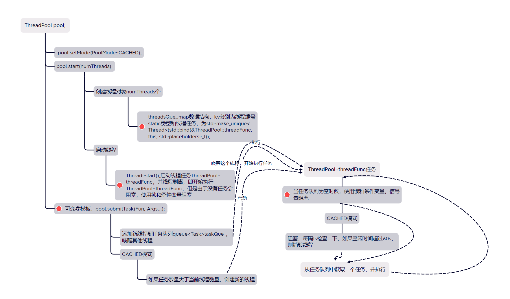

# mythreadpool较为复杂版本
本文件夹下，实现的mythreadpool较为复杂，Any类，信号量类均不使用库文件
## 编译为动态库
* 1 生成.so文件  
`g++ -fPIC -shared threadpool.cpp -o libtdpool.so -std=c++17`   
**-fPIC**表示告诉编译器生成的动态库，生成与位置无关的代码(Position-Independent Code,PIC)，他不依赖固定的内存地址，可以在内存任何位置加载和执行       
**-shared**表示生成一个动态链接库(shared library)  
**libtdpool.so**库的命名规则为lib<库名>.so  


* 2 移动.so文件，.h文件
`sudo mv libtdpool.so /usr/local/lib/`  
把.so文件移动到/usr/local/lib/  
`sudo mv threadpool.h /usr/local/include/`

* 3 编译文件,别忘了链接ltdpool库和lpthread  
` g++ test_thread_pool.cpp -std=c++17 -ltdpool -lpthread`

* 4 添加链接位置  
如果直接运行./a.out，运行报错不能发现libtdpool,`error while loading shared libraries: libtdpool.so: cannot open shared object file: No such file or directory`.  
因为运行时候要寻找链接库   
`vim /etc/ld.so.conf `: include /etc/ld.so.conf.d/*.conf 包含了所有.so文件，cd到/etc/ld.so.conf.d/下，有很多配置文件，`vim`一个关于我们自己库的。  
`vim mylib.conf`输入vim /usr/local/lib/ 位置，最后`loconfig`，刷新配置文件

## 线程池代码改造

### 1 使用feature和packaged_task代替Result，以节省代码  
packaged_task作为一个并发编程工具,可以将可调用的对象(如函数，lambda表达，)封装为一个异步任务，返回future对象以获得任务结果。他最大的优势是运行在另一个线程中执行，并获取结果。  
```cpp
// 在submitTask函数中，生成std::packaged_task<RType()>类型的智能指针任务task
auto task = std::make_shared<std::packaged_task<RType()>>(
			std::bind(std::forward<Func>(func), std::forward<Args>(args)...)
			);

// 在submitTask函数中，最终返回值是result
std::future<RType> result = task->get_future();
```
```cpp
// submitTask提交任务
future<int> res1 =  pool.submitTask(sum1, 1, 2);
// 得到返回值后，使用get()得到执行结果
// get语句是会阻塞的，如果任务还没有执行完就会阻塞，等待结果
cout << res1.get()<<endl;
```


上述代码中args，为一个可变参模板。  
一般使用`auto`可以推导返回值类型，但是太过复杂的容易出错，因此使用`->`显式的指出返回值类型，是返回`std::decltype`类型，但是`future<template T>`类型不知道，使用decltype(func(args...)推导具体类型。

### 2 增加可编程模板,达到可以这样提交的任务的样式`pool.submitTask(sun,10,20)`  
```cpp
// Func为要执行的任务，Args为要执行的任务的不定长参数
template<typename Func, typename... Args>
auto submitTask(Func&& func, Args&&... args) 
    -> std::future<decltype(func(args...))>
{

}
// 在调用任务时候可以是函数
future<int> res1 =  pool.submitTask(sum1, 1, 2);
// 也可以是lambda
future<int> res2 = pool.submitTask(
		[](int a, int b)->int {
			int res = 0;
			for (int i = a; i <= b; i++) res += i;
			return res;
		},1,20
	);
```

### 更加灵活的任务类型
直接定义`using Task = std::function<void()>;`
```cpp
// 创建任务：在submitTask函数中，生成std::packaged_task<RType()>类型的智能指针任务task
auto task = std::make_shared<std::packaged_task<RType()>>(
			std::bind(std::forward<Func>(func), std::forward<Args>(args)...)
			);
// 定义并填入任务队列
std::queue<Task>taskQue_;
// std::queue<Task>taskQue_; 也就是说我们可以把任意的void()函数传递进来
// (*task)() 调用了 std::packaged_task 中封装的任务函数,就相当于我们把任务task放入了任务队列中
taskQue_.emplace([task]() {(*task)();});
// 执行任务 在threadFunc中
cur_task = taskQue_.front();
// 相当于去除直接可以执行的任务
cur_task();
```
